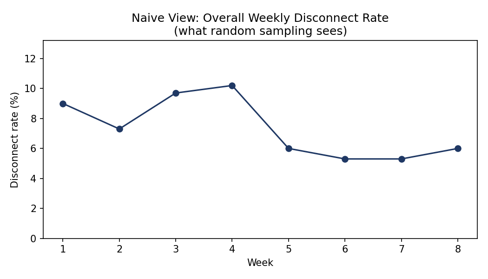
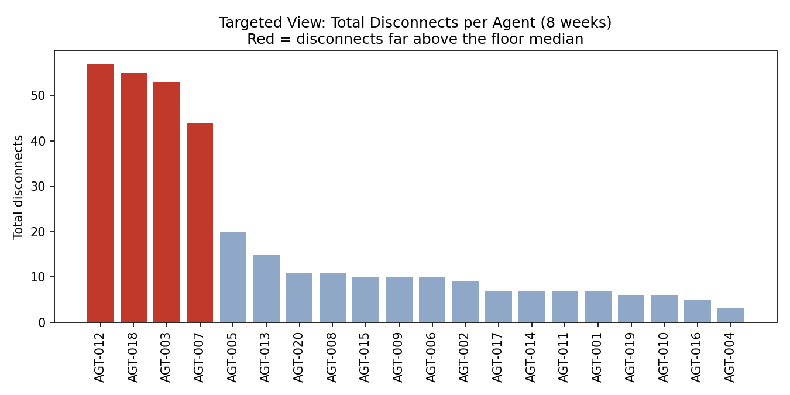
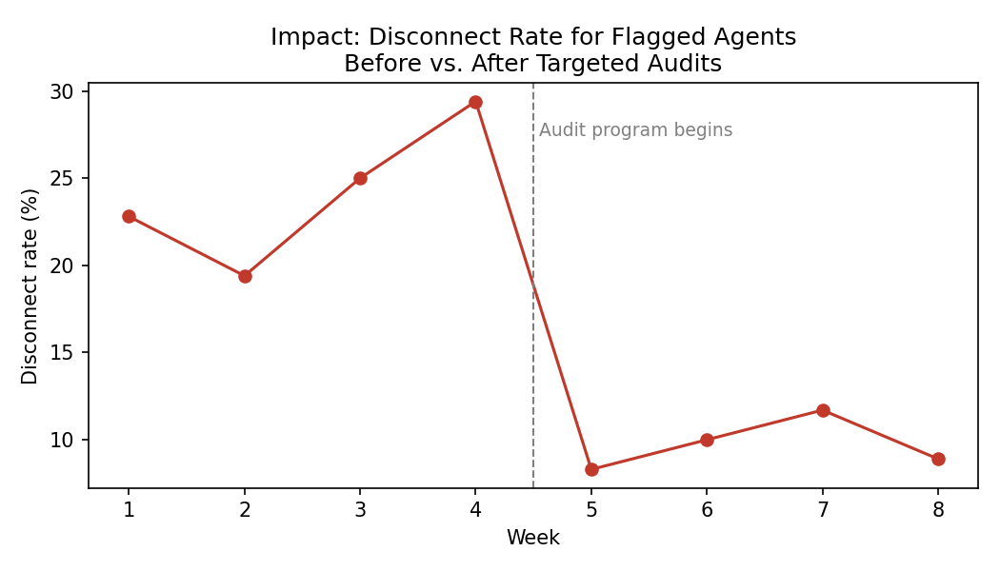

# Repeat-Offender Detection: Why Random Sampling Misses Work Avoidance

## The problem

In a high-volume call/chat operation, agents occasionally disconnect
interactions for genuine reasons — a power outage, a dropped connection,
the customer hanging up first. Those are normal and expected.

The harder problem: a small number of agents disconnect **far more often**
than chance would predict, usually on the interactions that require the
most effort (a tricky policy lookup, a customer who needs real
troubleshooting). On paper, every disconnect looks the same — logged
against a plausible reason code like "internet issue." Random sampling of
disconnected interactions can't tell the two groups apart, because it
never looks at **who** is disconnecting, only **how many** disconnects
happened in total.

This project rebuilds that detection problem end-to-end with synthetic
data: generate realistic interaction logs, show why the naive,
random-sample view hides the problem, then build the targeted,
per-agent view that actually surfaces it — and check whether corrective
action worked.

**Note:** all data here is synthetic, generated by `generate_data.py`.
No real company data is used or represented.

## Approach

1. **Naive view** — aggregate disconnect rate over time. This is what
   you'd see sampling interactions at random without grouping by agent.
   It's noisy and doesn't point anywhere actionable.
   

2. **Targeted view** — group disconnects by agent instead of by week.
   The signal that random sampling missed becomes obvious immediately:
   most agents disconnect a handful of times over 8 weeks; a small
   handful disconnect several times more than everyone else combined.
   

3. **Flagging rule** — rather than treating one bad week as evidence,
   the SQL flags agents who disconnect 3+ times in a single week. One
   bad week can happen to anyone; a pattern across multiple weeks is a
   different thing.

4. **Impact check** — for the flagged agents specifically, did the
   corrective program (audits, coaching, escalation) actually change
   behavior, or just add oversight without an effect?
   

   In this synthetic run: flagged agents' disconnect rate fell from a
   ~24% average in the 4 weeks before the audit program to ~10% in the
   4 weeks after — roughly a 60% relative reduction.

## Files

| File | What it does |
|---|---|
| `generate_data.py` | Builds the synthetic interaction dataset (`data/interactions.csv`) |
| `analysis.sql` | The five queries, in order, that build the naive → targeted → impact narrative |
| `analysis.py` | Runs those queries against SQLite and produces the three charts |
| `charts/` | Output charts (regenerated each run) |

## Running it

```bash
pip install pandas numpy matplotlib
python generate_data.py   # writes data/interactions.csv
python analysis.py        # writes charts/ and prints summary tables
```

## Why I built this

I led a version of this investigation for real — auditing agent
disconnects that were being logged against legitimate-sounding reasons
(power/internet issues) but were actually work avoidance on harder
cases. The real investigation used random sampling first, which didn't
surface the pattern; switching to per-agent frequency sampling did. This
project rebuilds that same reasoning end-to-end with synthetic data, as
something I could actually share.
